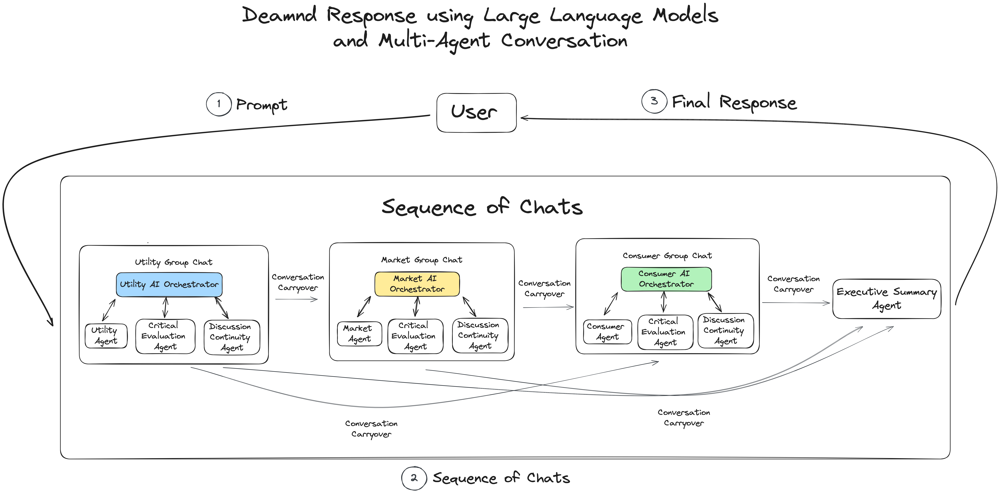

# LLM and Multi-Agent Collaboration for Demand Response
Demand response is a strategy that involves adjusting electricity usage in response to supply conditions or price signals to maintain grid stability and manage energy consumption.

Used is the multi-agent framework 'AutoGen' that allows us to create AI agents to represent the different stakeholders involved in demand response (operations, market, and consumer interests)

